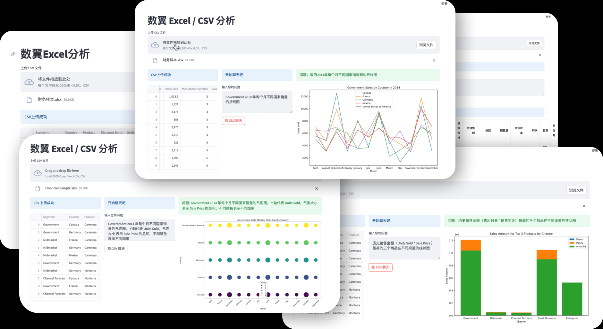

# streamlit-chatcsv
Chat and visualize with your **CSV** or **EXCEL** files use PandasAI and OpenAI.



## How to use

1. Clone the repository to your local machine.
```shell
git clone https://github.com/iDigitalWings/streamlit-chatcsv.git
cd streamlit-chatgpt
```
2. Install the dependencies with pip install -r requirements.txt.
```shell
pip install -r requirements.txt
```
3. Run the app with streamlit run app.py. 

```shell
streamlit run app_v2.py
```

## More


